# Atividade Prática — Docker + Compose + CI

Empacotamento do app de exemplo [docker/getting-started-app](https://github.com/docker/getting-started-app) (To-Do em Node.js) em containers, com Dockerfile multi-stage, volumes, rede, Docker Compose e CI no GitHub Actions.

## Sobre o app

- Runtime: Node.js 18+
- Início: `node src/index.js`
- Porta interna: `3000`
- Banco padrão: SQLite (`/etc/todos/todo.db`)
- Banco alternativo: MySQL, via variáveis `MYSQL_HOST`, `MYSQL_USER`, `MYSQL_PASSWORD`, `MYSQL_DB`
- API: `GET /items`, `POST /items`

## Parte 1 — Dockerfile multi-stage

Dockerfile com dois estágios: `builder` (instala apenas dependências de produção com `npm ci --omit=dev`) e o estágio final, que copia seletivamente `node_modules`, `package.json` e `src` do builder — sem devDependencies e sem os arquivos de teste. Usuário final é `node` (não-root).

**Por que o multi-stage ajuda no tamanho/segurança da imagem final:** ao copiar só os artefatos necessários (dependências de produção + código-fonte) para o estágio final, a imagem não carrega ferramentas de build nem devDependencies, ficando menor e com menos superfície de ataque.

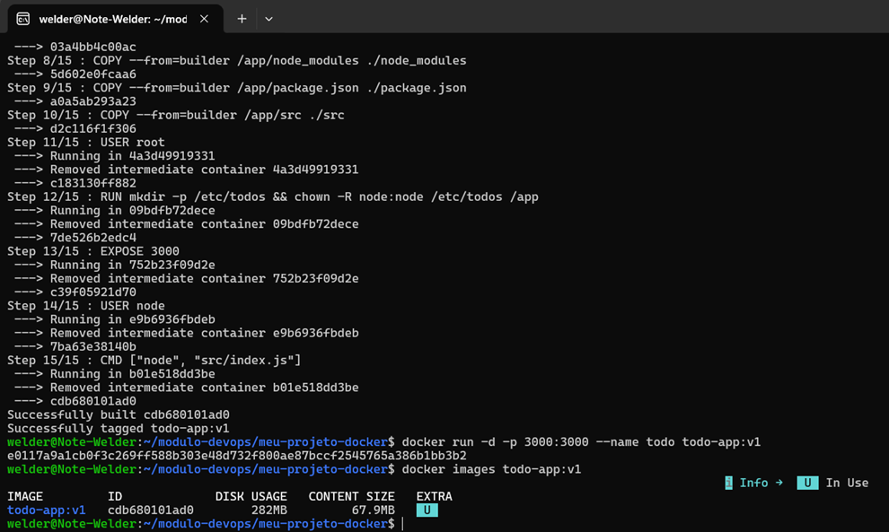

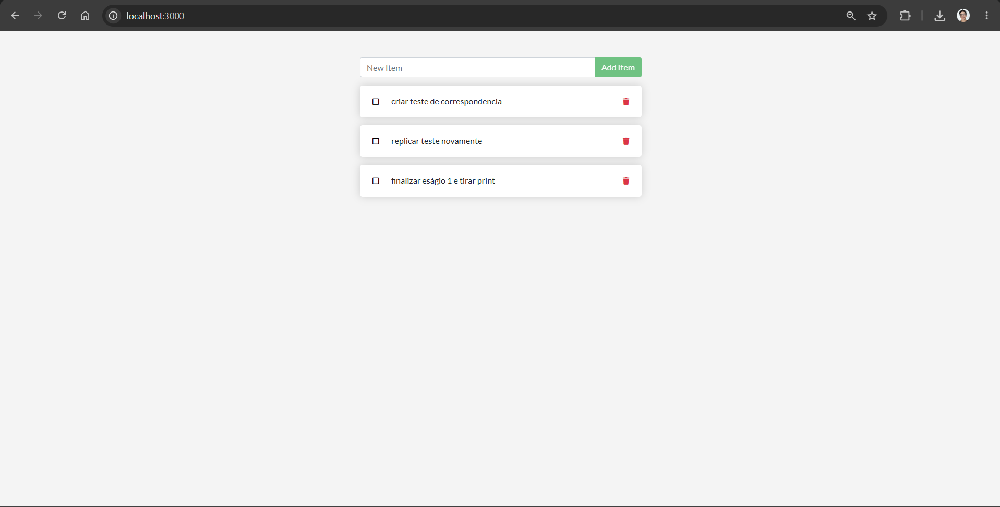

## Parte 2 — Volume e persistência

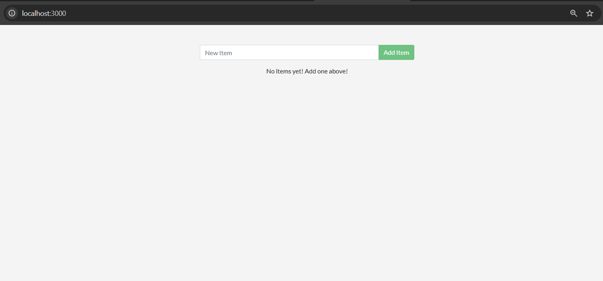

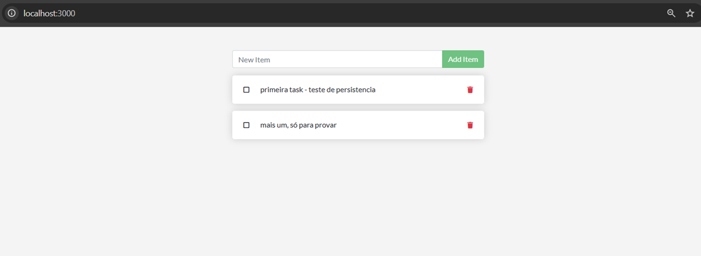

`docker volume ls`:

```
DRIVER    VOLUME NAME
local     f20f0604d8e9a224c5d574694a50d4c6e0b8b892cf3bf46ebb67e3f62c9f4c46
local     todo-db
```

## Parte 3 — Rede

`docker network inspect todo-net`:

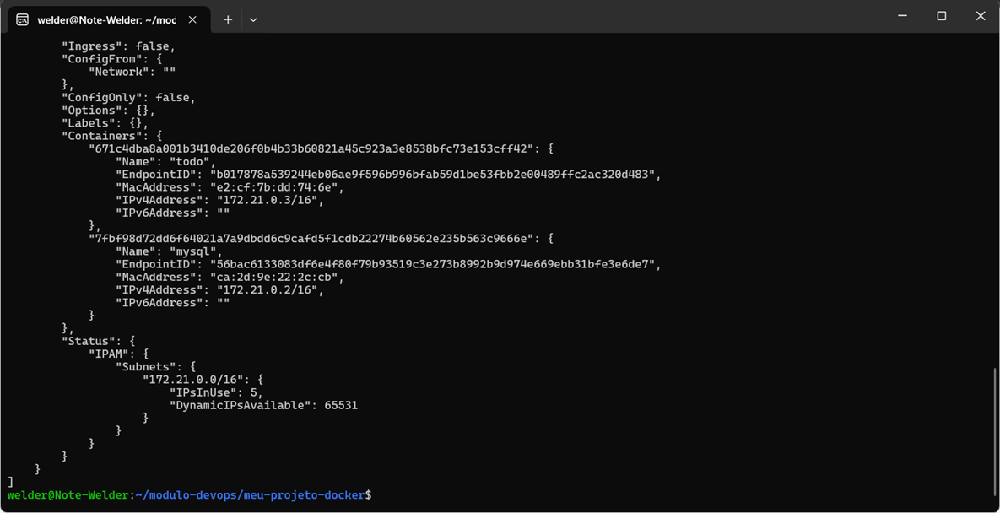

`select * from todo_items;` dentro do MySQL:

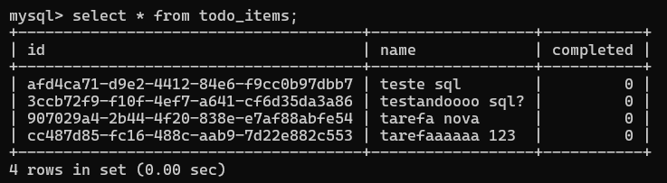

**Por que o app consegue chamar o host `mysql` sem saber o IP dele:** containers na mesma rede definida pelo usuário usam o DNS interno do Docker, que resolve o nome do container (ou `--network-alias`) para o IP correto automaticamente.

## Parte 4 — Docker Compose

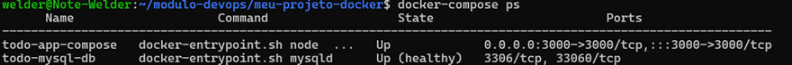

Teste de persistência:

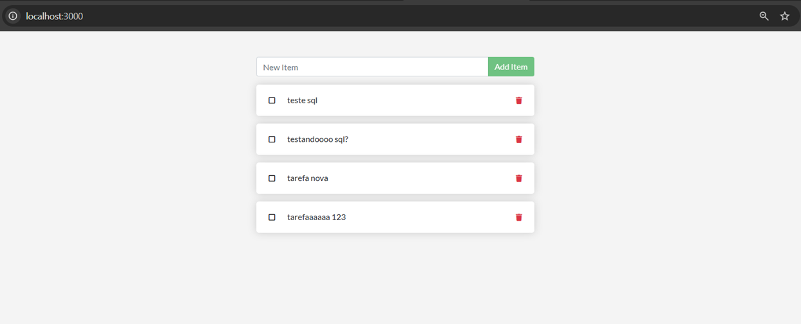

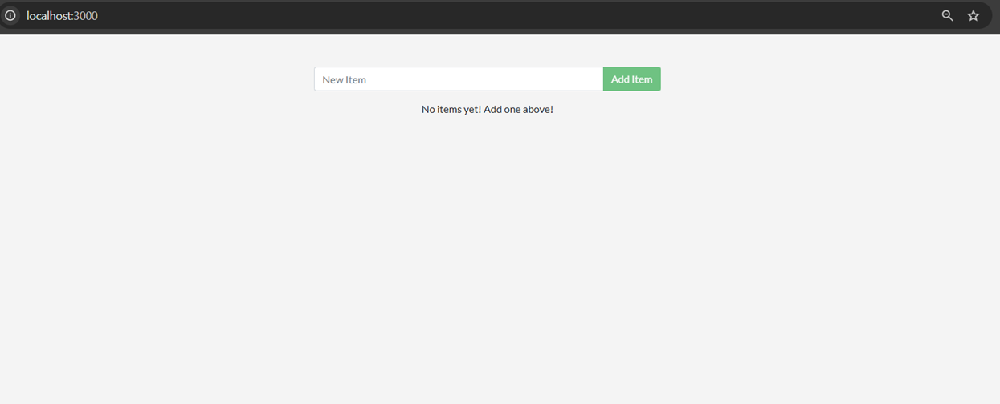

**Diferença entre `docker compose down` e `docker compose down -v`:** o primeiro remove containers e rede mas mantém os volumes nomeados (dados preservados); o segundo também remove os volumes, apagando os dados.

## Parte 5 — CI com GitHub Actions

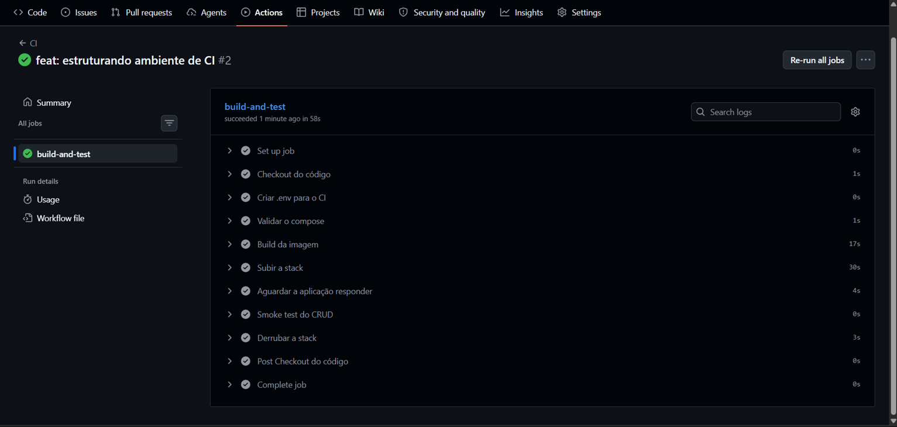

## Parte 6 — Quebra proposital do CI

**O que foi quebrado:** colocado caminho errado do index

**Como o CI reagiu/Como descobri pelos logs:** na hora de "Esperar a aplicação responder" em actions deu bug. Error: Cannot find module '/app/src/indexx.js'


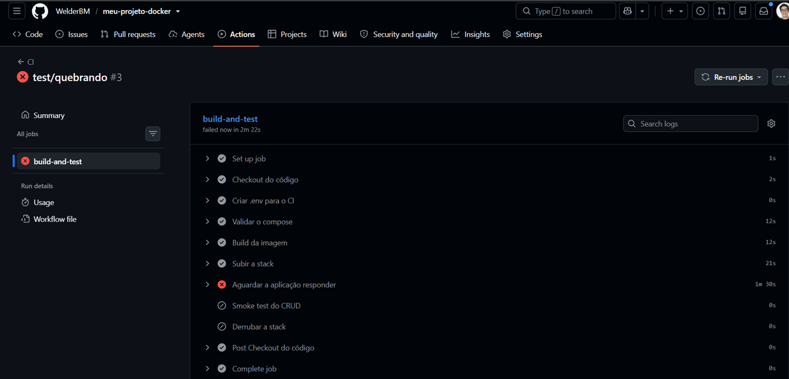

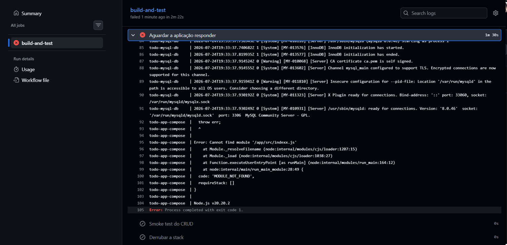

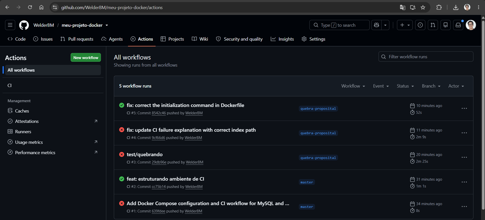

## Checklist de entrega

- [x] Repositório com histórico de commits
- [ ] Dockerfile multi-stage funcional + `.dockerignore`
- [ ] `compose.yaml` com rede, volume nomeado, variáveis de ambiente e healthcheck
- [ ] `.env.example` versionado e `.env` ignorado
- [ ] Workflow do GitHub Actions funcionando
- [ ] PR com CI vermelho e depois verde
- [ ] README preenchido com todos os prints e respostas
